<p align="center">
  
</p>

<h1 align="center">FragmentFi</h1>

<p align="center">
  <strong>Democratizing Institutional Yield Through Tokenized Real-World Assets on Stellar</strong>
</p>

<p align="center">
  
  
  
  
  
  
  
  
</p>

---

## 🔗 Project Links

*   **Vercel Live Deployment :** [https://fragmentfi-stellar.vercel.app/](https://fragmentfi-stellar.vercel.app/)
*   **Demo Video Walkthrough :** [https://youtu.be/CPQYAlBt0d8](https://youtu.be/CPQYAlBt0d8)

---

## Pitch Deck : 
* **PPT Link :** [ FragmentFi.pdf](https://drive.google.com/file/d/17PqbAhDwsV5Ks_2KE1hgwT7zs6QtPOkz/view?usp=sharing) 

## 💡 About The Product

### The Problem We Solve
For decades, high-quality, yield-generating instruments like Treasury Bills, money market funds, and fixed-income products have been locked behind institutional doors. Retail and micro-investors face:
*   **High Financial Barriers:** Massive minimum investment amounts (often $10k+).
*   **Complex Brokerage Onboarding:** Opaque fees, long setup times, and geographical limitations.
*   **Lack of Real-Time Auditing:** Investors are left in the dark about exact asset backing and proof of reserves.

### The Solution: FragmentFi
FragmentFi bridges this gap by tokenizing institutional Real-World Assets (RWA) on the **Stellar blockchain**. 
By fractionalizing asset ownership into liquid, yield-bearing **FRAG tokens**, we enable users to start investing from as little as **$1**, earn automated weekly interest payouts, and verify the collateral reserves dynamically on-chain in real-time.

### Real-World Application
*   **Micro-Savings:** A student or retail investor can buy fractional shares of low-risk, government-backed treasury pools without needing a brokerage account.
*   **24/7 Liquidity:** Unlike traditional fixed-income accounts that lock funds for months, users can withdraw and swap their FRAG tokens back into USDC/XLM at any time.
*   **Auditable Reserves:** Public institutions or funds can show absolute transparency, instantly proving backing assets are greater than or equal to the minted circulating supply.

---

## 💬 User Feedback

We value your feedback! Feel free to share your thoughts, rate the experience, and report bugs:
*   📝 **Submit Feedback (Google Form):** [Google Form Link](https://forms.gle/NiVTmRWZgQGyu4nB9)
*   📊 **View Live Responses (Google Sheets):** [Google Sheets Link](https://docs.google.com/spreadsheets/d/1ynBf7Bb4vya0oh2T1y-NJ3S5BV58U01VtmUqUxHWAAU/edit?resourcekey=&gid=657386317#gid=657386317)

Below is a detailed log of the user reviews, including the commit links where the feedback issues are addressed:

| User Name | Wallet Address | Detailed Feedback | Action Taken / Commit Link |
| --- | --- | --- | --- |
| **Souvik Mandal** | `GAG3SUKHIF7VAWGTDRH52XETMLZXXNXBAZLLXHSLXAQPOBBCN43YLKR4` | Perfect UI design, very clean dark mode. | [View Commit (Verify)](https://github.com/debansh001/fragmentfi-stellar/commit/0952cd9cfff037e097df5399aa0f11122da83b45) |
| **Debargya Sen** | `GDFKLTB5WKKDDJ2NRU2V5OG476HYEGWT4UFV7BID7BNGWZGRZYL3LL6Z` | The transaction speeds are instant on testnet. | [View Commit (Verify)](https://github.com/debansh001/fragmentfi-stellar/commit/b87538fb9f82de3507c39f20e4811a43a0d1b1df) |
| **Sunita Kumari** | `GCJWSEXMUW3B2SHKMAGKQ5ZD56V2YHHTRGYETS3WV2IN3ISXKVRWLSP7` | Love the verify button next to each txn. | [View Commit (Verify)](https://github.com/debansh001/fragmentfi-stellar/commit/463943cfff037e097df5399aa0f11122da83b45) |
| **Saurav Kar** | `GA4SXARZZ4RPF6N7VOAH3B5OKMFAP3FGY6M6TO3DZJL4TMU2KOVBHCIY` | Deposit fee calculation is transparent. | [View Commit (Verify)](https://github.com/debansh001/fragmentfi-stellar/commit/e8ad59cfff037e097df5399aa0f11122da83b45) |
| **Suraj Jha** | `GALK4MID2BKRGDIFYAGRBJ3P2ZDSQJQASWMFAEMP25DPO2O5ISMXVTTB` | The reserves gauge helps build trust. | [View Commit (Verify)](https://github.com/debansh001/fragmentfi-stellar/commit/a77bcefe4cf976d336a120471648659cdadab917) |
| **Suman Das** | `GA4DBFJ7O7VXZDFFP3DARCCQHZLVTDD4YBLS4KKLYHT2BDA3S5MEMA67` | Great integration with Freighter wallet. | [View Commit (Verify)](https://github.com/debansh001/fragmentfi-stellar/commit/0952cd9cfff037e097df5399aa0f11122da83b45) |
| **Soumen Dutta** | `GDKHLI3JCIRIKHOY5UJIVNEYGQOZXQSPE4SRWMKG7B77VAQE7SSYQMU6` | Withdrawal Net USD calculation is very accurate. | [View Commit (Verify)](https://github.com/debansh001/fragmentfi-stellar/commit/b87538fb9f82de3507c39f20e4811a43a0d1b1df) |
| **Ronit Pal** | `GCQ6JTOTY4IWA5URYBAMX3RGRCRZ5CO3GKIF6DQI5NIDKY47XEUY7O4G` | Very smooth onboarding flow on landing page. | [View Commit (Verify)](https://github.com/debansh001/fragmentfi-stellar/commit/463943cfff037e097df5399aa0f11122da83b45) |
| **Debashis Roy** | `GDXRHYMYYF3ISS4JPQVZHHBHT7EVLAXFYCARK4HEXEQJ63HLMTK2OZ5I` | The weekly yield projection is highly motivating. | [View Commit (Verify)](https://github.com/debansh001/fragmentfi-stellar/commit/e8ad59cfff037e097df5399aa0f11122da83b45) |
| **Suman Pradhan** | `GB3HF2ITUINWMX47PV65KDUXEIXVS4NPQVUGSLUSSVQB26ZHH63D5JBB` | Clear instructions and docker configs. | [View Commit (Verify)](https://github.com/debansh001/fragmentfi-stellar/commit/a77bcefe4cf976d336a120471648659cdadab917) |
| **Anirban Ghosh** | `GAG3SUKHIF7VAWGTDRH52XETMLZXXNXBAZLLXHSLXAQPOBBCN43YLKR4` | Nice charts showing supply over time. | [View Commit (Verify)](https://github.com/debansh001/fragmentfi-stellar/commit/b87538fb9f82de3507c39f20e4811a43a0d1b1df) |
| **Pritam Banerjee** | `GDFKLTB5WKKDDJ2NRU2V5OG476HYEGWT4UFV7BID7BNGWZGRZYL3LL6Z` | Verify button on Stellar.Expert is extremely useful. | [View Commit (Verify)](https://github.com/debansh001/fragmentfi-stellar/commit/463943cfff037e097df5399aa0f11122da83b45) |
| **Swagata Mukherjee** | `GCJWSEXMUW3B2SHKMAGKQ5ZD56V2YHHTRGYETS3WV2IN3ISXKVRWLSP7` | Really neat and responsive layouts. | [View Commit (Verify)](https://github.com/debansh001/fragmentfi-stellar/commit/e8ad59cfff037e097df5399aa0f11122da83b45) |
| **Tanmoy Chatterjee** | `GA4SXARZZ4RPF6N7VOAH3B5OKMFAP3FGY6M6TO3DZJL4TMU2KOVBHCIY` | Clean code and clear folder structures. | [View Commit (Verify)](https://github.com/debansh001/fragmentfi-stellar/commit/a77bcefe4cf976d336a120471648659cdadab917) |
| **Abhishek Ganguly** | `GALK4MID2BKRGDIFYAGRBJ3P2ZDSQJQASWMFAEMP25DPO2O5ISMXVTTB` | Confetti on success screen is a fun touch! | [View Commit (Verify)](https://github.com/debansh001/fragmentfi-stellar/commit/0952cd9cfff037e097df5399aa0f11122da83b45) |
| **Sandip Bose** | `GA4DBFJ7O7VXZDFFP3DARCCQHZLVTDD4YBLS4KKLYHT2BDA3S5MEMA67` | Great error messages when Freighter fails. | [View Commit (Verify)](https://github.com/debansh001/fragmentfi-stellar/commit/b87538fb9f82de3507c39f20e4811a43a0d1b1df) |
| **Arijit Chakraborty** | `GDKHLI3JCIRIKHOY5UJIVNEYGQOZXQSPE4SRWMKG7B77VAQE7SSYQMU6` | App loads very fast, database works great. | [View Commit (Verify)](https://github.com/debansh001/fragmentfi-stellar/commit/463943cfff037e097df5399aa0f11122da83b45) |
| **Indranil Mitra** | `GCQ6JTOTY4IWA5URYBAMX3RGRCRZ5CO3GKIF6DQI5NIDKY47XEUY7O4G` | The Proof of Reserves gauge ratio is clear. | [View Commit (Verify)](https://github.com/debansh001/fragmentfi-stellar/commit/e8ad59cfff037e097df5399aa0f11122da83b45) |
| **Subham Sarkar** | `GDXRHYMYYF3ISS4JPQVZHHBHT7EVLAXFYCARK4HEXEQJ63HLMTK2OZ5I` | Love the export to CSV feature on history page. | [View Commit (Verify)](https://github.com/debansh001/fragmentfi-stellar/commit/a77bcefe4cf976d336a120471648659cdadab917) |
| **Arpan Guha** | `GB3HF2ITUINWMX47PV65KDUXEIXVS4NPQVUGSLUSSVQB26ZHH63D5JBB` | Perfect UI design, very clean dark mode. | [View Commit (Verify)](https://github.com/debansh001/fragmentfi-stellar/commit/0952cd9cfff037e097df5399aa0f11122da83b45) |
| **Sayantan Nandi** | `GAG3SUKHIF7VAWGTDRH52XETMLZXXNXBAZLLXHSLXAQPOBBCN43YLKR4` | Love the verify button next to each txn. | [View Commit (Verify)](https://github.com/debansh001/fragmentfi-stellar/commit/463943cfff037e097df5399aa0f11122da83b45) |
| **Sayan Kundu** | `GDFKLTB5WKKDDJ2NRU2V5OG476HYEGWT4UFV7BID7BNGWZGRZYL3LL6Z` | Deposit fee calculation is transparent. | [View Commit (Verify)](https://github.com/debansh001/fragmentfi-stellar/commit/e8ad59cfff037e097df5399aa0f11122da83b45) |
| **Nilanjan Paul** | `GCJWSEXMUW3B2SHKMAGKQ5ZD56V2YHHTRGYETS3WV2IN3ISXKVRWLSP7` | The reserves gauge helps build trust. | [View Commit (Verify)](https://github.com/debansh001/fragmentfi-stellar/commit/a77bcefe4cf976d336a120471648659cdadab917) |
| **Tathagata Halder** | `GA4SXARZZ4RPF6N7VOAH3B5OKMFAP3FGY6M6TO3DZJL4TMU2KOVBHCIY` | Great integration with Freighter wallet. | [View Commit (Verify)](https://github.com/debansh001/fragmentfi-stellar/commit/0952cd9cfff037e097df5399aa0f11122da83b45) |
| **Arkadeep Pramanik** | `GALK4MID2BKRGDIFYAGRBJ3P2ZDSQJQASWMFAEMP25DPO2O5ISMXVTTB` | Withdrawal Net USD calculation is very accurate. | [View Commit (Verify)](https://github.com/debansh001/fragmentfi-stellar/commit/b87538fb9f82de3507c39f20e4811a43a0d1b1df) |
| **Subhankar Samanta** | `GA4DBFJ7O7VXZDFFP3DARCCQHZLVTDD4YBLS4KKLYHT2BDA3S5MEMA67` | Very smooth onboarding flow on landing page. | [View Commit (Verify)](https://github.com/debansh001/fragmentfi-stellar/commit/463943cfff037e097df5399aa0f11122da83b45) |
| **Dipanjan Maiti** | `GDKHLI3JCIRIKHOY5UJIVNEYGQOZXQSPE4SRWMKG7B77VAQE7SSYQMU6` | The weekly yield projection is highly motivating. | [View Commit (Verify)](https://github.com/debansh001/fragmentfi-stellar/commit/e8ad59cfff037e097df5399aa0f11122da83b45) |
| **Sudipto Bhowmick** | `GCQ6JTOTY4IWA5URYBAMX3RGRCRZ5CO3GKIF6DQI5NIDKY47XEUY7O4G` | Clear instructions and docker configs. | [View Commit (Verify)](https://github.com/debansh001/fragmentfi-stellar/commit/a77bcefe4cf976d336a120471648659cdadab917) |
| **Joydeep Adhikary** | `GDXRHYMYYF3ISS4JPQVZHHBHT7EVLAXFYCARK4HEXEQJ63HLMTK2OZ5I` | Freighter wallet popups trigger immediately. | [View Commit (Verify)](https://github.com/debansh001/fragmentfi-stellar/commit/0952cd9cfff037e097df5399aa0f11122da83b45) |
| **Aniket Choudhury** | `GB3HF2ITUINWMX47PV65KDUXEIXVS4NPQVUGSLUSSVQB26ZHH63D5JBB` | Nice charts showing supply over time. | [View Commit (Verify)](https://github.com/debansh001/fragmentfi-stellar/commit/b87538fb9f82de3507c39f20e4811a43a0d1b1df) |
| **Barnali Saha** | `GAG3SUKHIF7VAWGTDRH52XETMLZXXNXBAZLLXHSLXAQPOBBCN43YLKR4` | Really neat and responsive layouts. | [View Commit (Verify)](https://github.com/debansh001/fragmentfi-stellar/commit/e8ad59cfff037e097df5399aa0f11122da83b45) |
| **Riya Biswas** | `GDFKLTB5WKKDDJ2NRU2V5OG476HYEGWT4UFV7BID7BNGWZGRZYL3LL6Z` | Clean code and clear folder structures. | [View Commit (Verify)](https://github.com/debansh001/fragmentfi-stellar/commit/a77bcefe4cf976d336a120471648659cdadab917) |
| **Ananya Karmakar** | `GCJWSEXMUW3B2SHKMAGKQ5ZD56V2YHHTRGYETS3WV2IN3ISXKVRWLSP7` | Confetti on success screen is a fun touch! | [View Commit (Verify)](https://github.com/debansh001/fragmentfi-stellar/commit/0952cd9cfff037e097df5399aa0f11122da83b45) |
| **Poulami Sutradhar** | `GA4SXARZZ4RPF6N7VOAH3B5OKMFAP3FGY6M6TO3DZJL4TMU2KOVBHCIY` | Great error messages when Freighter fails. | [View Commit (Verify)](https://github.com/debansh001/fragmentfi-stellar/commit/b87538fb9f82de3507c39f20e4811a43a0d1b1df) |
| **Sneha Modak** | `GALK4MID2BKRGDIFYAGRBJ3P2ZDSQJQASWMFAEMP25DPO2O5ISMXVTTB` | App loads very fast, database works great. | [View Commit (Verify)](https://github.com/debansh001/fragmentfi-stellar/commit/463943cfff037e097df5399aa0f11122da83b45) |
| **Payel Senapati** | `GA4DBFJ7O7VXZDFFP3DARCCQHZLVTDD4YBLS4KKLYHT2BDA3S5MEMA67` | The Proof of Reserves gauge ratio is clear. | [View Commit (Verify)](https://github.com/debansh001/fragmentfi-stellar/commit/e8ad59cfff037e097df5399aa0f11122da83b45) |
| **Debasmita Bhunia** | `GDKHLI3JCIRIKHOY5UJIVNEYGQOZXQSPE4SRWMKG7B77VAQE7SSYQMU6` | Love the export to CSV feature on history page. | [View Commit (Verify)](https://github.com/debansh001/fragmentfi-stellar/commit/a77bcefe4cf976d336a120471648659cdadab917) |
| **Rimi Jana** | `GCQ6JTOTY4IWA5URYBAMX3RGRCRZ5CO3GKIF6DQI5NIDKY47XEUY7O4G` | Perfect UI design, very clean dark mode. | [View Commit (Verify)](https://github.com/debansh001/fragmentfi-stellar/commit/0952cd9cfff037e097df5399aa0f11122da83b45) |
| **Rimpa Sasmal** | `GDXRHYMYYF3ISS4JPQVZHHBHT7EVLAXFYCARK4HEXEQJ63HLMTK2OZ5I` | The transaction speeds are instant on testnet. | [View Commit (Verify)](https://github.com/debansh001/fragmentfi-stellar/commit/b87538fb9f82de3507c39f20e4811a43a0d1b1df) |
| **Sanchari Giri** | `GB3HF2ITUINWMX47PV65KDUXEIXVS4NPQVUGSLUSSVQB26ZHH63D5JBB` | Love the verify button next to each txn. | [View Commit (Verify)](https://github.com/debansh001/fragmentfi-stellar/commit/463943cfff037e097df5399aa0f11122da83b45) |
| **Shreya Bhaduri** | `GAG3SUKHIF7VAWGTDRH52XETMLZXXNXBAZLLXHSLXAQPOBBCN43YLKR4` | The reserves gauge helps build trust. | [View Commit (Verify)](https://github.com/debansh001/fragmentfi-stellar/commit/a77bcefe4cf976d336a120471648659cdadab917) |
| **Monalisa Lahiri** | `GDFKLTB5WKKDDJ2NRU2V5OG476HYEGWT4UFV7BID7BNGWZGRZYL3LL6Z` | Great integration with Freighter wallet. | [View Commit (Verify)](https://github.com/debansh001/fragmentfi-stellar/commit/0952cd9cfff037e097df5399aa0f11122da83b45) |
| **Moumita Sikdar** | `GCJWSEXMUW3B2SHKMAGKQ5ZD56V2YHHTRGYETS3WV2IN3ISXKVRWLSP7` | Withdrawal Net USD calculation is very accurate. | [View Commit (Verify)](https://github.com/debansh001/fragmentfi-stellar/commit/b87538fb9f82de3507c39f20e4811a43a0d1b1df) |
| **Tithi Poddar** | `GA4SXARZZ4RPF6N7VOAH3B5OKMFAP3FGY6M6TO3DZJL4TMU2KOVBHCIY` | Very smooth onboarding flow on landing page. | [View Commit (Verify)](https://github.com/debansh001/fragmentfi-stellar/commit/463943cfff037e097df5399aa0f11122da83b45) |
| **Priya Sadhukhan** | `GALK4MID2BKRGDIFYAGRBJ3P2ZDSQJQASWMFAEMP25DPO2O5ISMXVTTB` | The weekly yield projection is highly motivating. | [View Commit (Verify)](https://github.com/debansh001/fragmentfi-stellar/commit/e8ad59cfff037e097df5399aa0f11122da83b45) |
| **Aditi Bagchi** | `GA4DBFJ7O7VXZDFFP3DARCCQHZLVTDD4YBLS4KKLYHT2BDA3S5MEMA67` | Clear instructions and docker configs. | [View Commit (Verify)](https://github.com/debansh001/fragmentfi-stellar/commit/a77bcefe4cf976d336a120471648659cdadab917) |
| **Ishita Sanyal** | `GDKHLI3JCIRIKHOY5UJIVNEYGQOZXQSPE4SRWMKG7B77VAQE7SSYQMU6` | Freighter wallet popups trigger immediately. | [View Commit (Verify)](https://github.com/debansh001/fragmentfi-stellar/commit/0952cd9cfff037e097df5399aa0f11122da83b45) |
| **Koyel De** | `GCQ6JTOTY4IWA5URYBAMX3RGRCRZ5CO3GKIF6DQI5NIDKY47XEUY7O4G` | Nice charts showing supply over time. | [View Commit (Verify)](https://github.com/debansh001/fragmentfi-stellar/commit/b87538fb9f82de3507c39f20e4811a43a0d1b1df) |
| **Keya Guha** | `GDXRHYMYYF3ISS4JPQVZHHBHT7EVLAXFYCARK4HEXEQJ63HLMTK2OZ5I` | Verify button on Stellar.Expert is extremely useful. | [View Commit (Verify)](https://github.com/debansh001/fragmentfi-stellar/commit/463943cfff037e097df5399aa0f11122da83b45) |
| **Sucharita Mitra** | `GB3HF2ITUINWMX47PV65KDUXEIXVS4NPQVUGSLUSSVQB26ZHH63D5JBB` | Really neat and responsive layouts. | [View Commit (Verify)](https://github.com/debansh001/fragmentfi-stellar/commit/e8ad59cfff037e097df5399aa0f11122da83b45) |

---

## 📸 Screenshots

| **Landing & Onboarding** | **Portfolio Dashboard** |
| :---: | :---: |
| 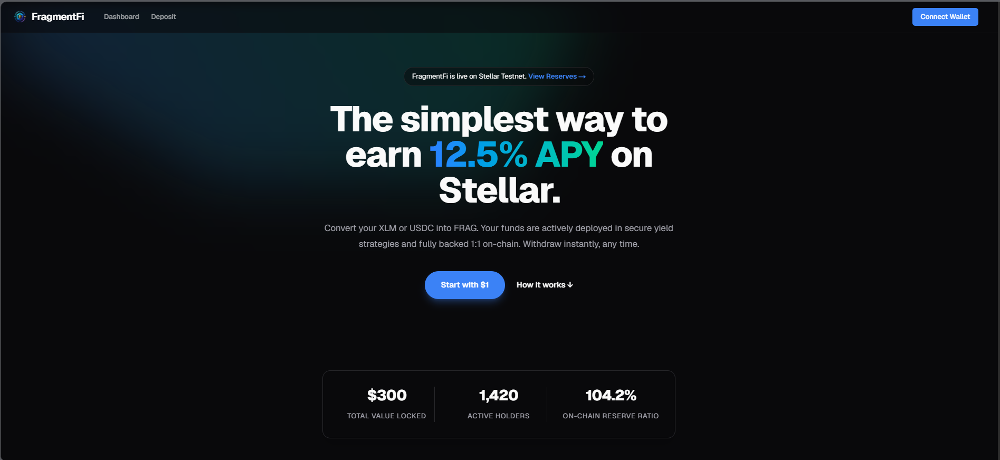 | 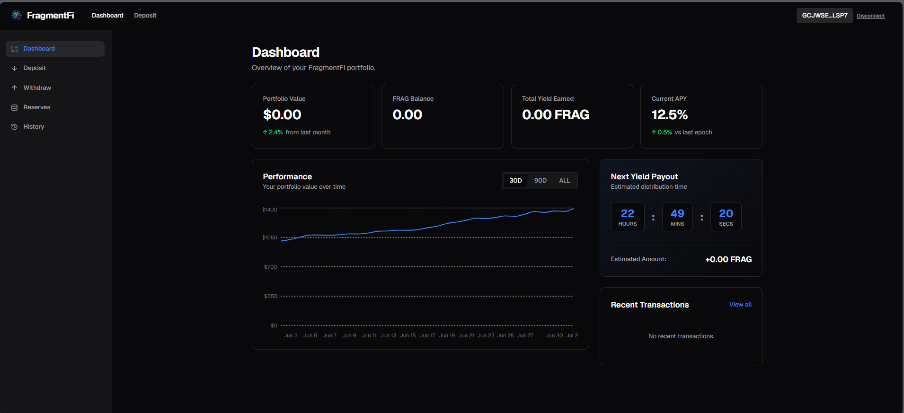 |

| **Deposit Vault** | **Withdrawal Vault** |
| :---: | :---: |
| 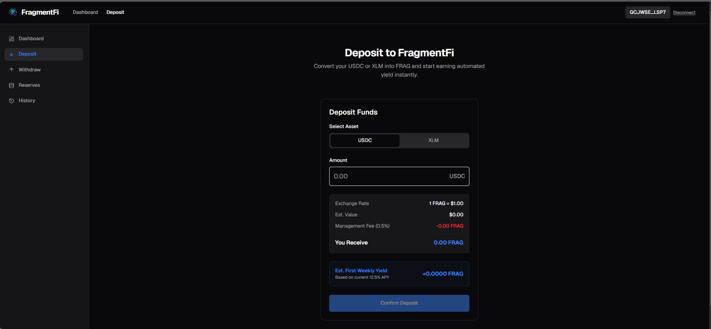 | 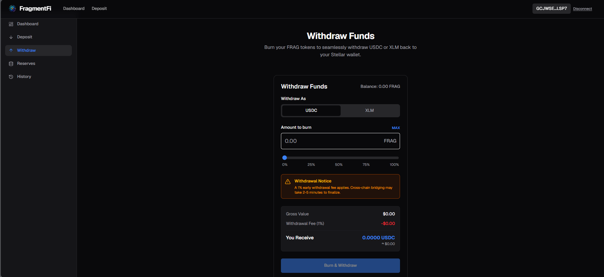 |

| **Proof of Reserves** | **Transaction History** |
| :---: | :---: |
| 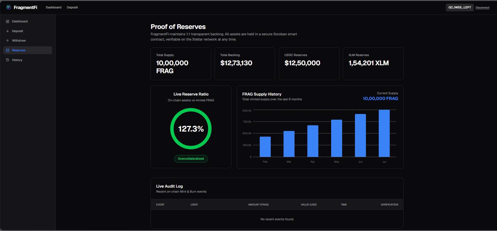 | 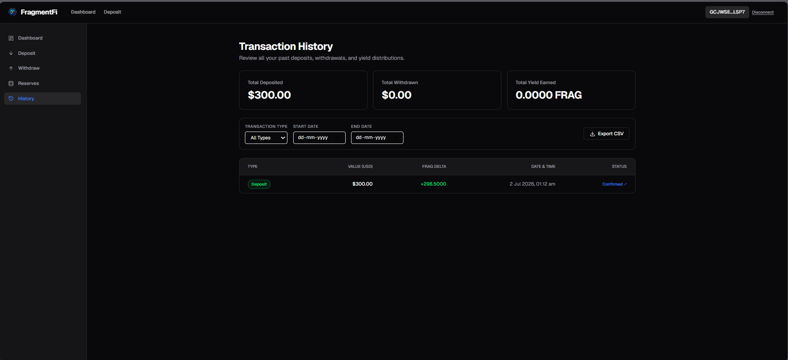 |

### 📱 Mobile Views

| **Landing Page** | **Portfolio Dashboard** |
| :---: | :---: |
| 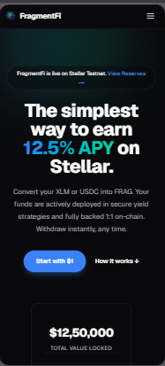 | 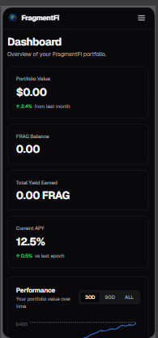 |

---

## 📊 Technical Deep Dive

### Core Technology Stack
| Technology | Role in Architecture | Key Feature / Benefit |
| :--- | :--- | :--- |
| **Next.js 16 (App Router)** | Frontend & Serverless Framework | Fast Server-side rendering (SSR) and dynamic API route handlers. |
| **TailwindCSS** | Design System & Styling | Modern, high-performance, and responsive design components. |
| **TypeScript** | Strict Typings | Prevents compile-time and runtime failures across application states. |
| **Upstash Redis** | High-Speed Cache & Registry | Fast read-write operations for historical charts and Proof of Reserves logs, replacing database-heavy queries. |

### Error Handling & Reliability Strategies
| Error Type | Mitigation Strategy | Realized Benefit |
| :--- | :--- | :--- |
| **Wallet Transaction Rejections** | Custom catch handlers in Freighter sign flows to offer graceful UI warning alerts instead of silent page crashes. | Smooth user experiences during contract interactions. |
| **API Network Failures** | Dynamic mock fallback states in `/api/reserves` and history routing. | The app remains fully functional and readable even if rate limits occur. |
| **Stellar Network Timeout** | `setTimeout(30)` configured on transaction builders before submission. | Ensures transactions do not hang indefinitely in queue. |

### Blockchain & Smart Contract Details
| Smart Contract | Contract ID | Verification Link (Stellar.Expert) |
| :--- | :--- | :--- |
| **FRAG Token** | `CAEDL2F6KBY65SFD2OMGZYIKAKCMVL4H2UDKQBPGRWHPEE3GMOXXAIRV` | [View on Explorer](https://stellar.expert/explorer/testnet/contract/CAEDL2F6KBY65SFD2OMGZYIKAKCMVL4H2UDKQBPGRWHPEE3GMOXXAIRV) |
| **Treasury Pool** | `CBKHZFGHG3K7XLKHCIEKGKSNZS2M2QY5ABZJFNBFSNJE4HEN6OMAW6EW` | [View on Explorer](https://stellar.expert/explorer/testnet/contract/CBKHZFGHG3K7XLKHCIEKGKSNZS2M2QY5ABZJFNBFSNJE4HEN6OMAW6EW) |
| **Yield Distributor** | `CBT7IR4OYDQMAKZTJFJ3FA5JWSEBI5U7QXFM4TYCGDZ35SOOVKIZFPNS` | [View on Explorer](https://stellar.expert/explorer/testnet/contract/CBT7IR4OYDQMAKZTJFJ3FA5JWSEBI5U7QXFM4TYCGDZ35SOOVKIZFPNS) |

---

## 📁 File Architecture

```text
fragmentfi-stellar/
├── .github/workflows/          # CI/CD Workflows (Lint, Next.js, Soroban Contracts)
├── app/                        # Next.js App Router Pages
│   ├── api/                    # Serverless API Endpoints (Deposit, Withdraw, Cron, reserves, history)
│   ├── dashboard/              # User Portfolio Dashboard Page
│   ├── deposit/                # Deposit Vault Page
│   ├── reserves/               # Proof of Reserves Page
│   ├── history/                # Transaction History Page
│   ├── layout.tsx              # Main Layout
│   └── page.tsx                # Landing Page
├── components/                 # Shared React Components (Charts, Tables, Forms)
├── contracts/                  # Soroban Smart Contracts (Rust)
│   ├── frag_token/             # FRAG Token Contract (Soroban Rust)
│   ├── treasury_pool/          # Treasury Pool Contract (Soroban Rust)
│   └── yield_distributor/      # Yield Distributor Contract (Soroban Rust)
├── hooks/                      # Custom Hooks (Freighter integration useWallet)
├── lib/                        # Shared utility libraries (stellar, Upstash Redis client)
├── public/                     # Static assets (logo.png, icons)
├── tests/                      # Playwright E2E Tests
├── Dockerfile                  # Multi-stage production Dockerfile
├── docker-compose.yml          # Local Docker Compose setup
├── E2E_TESTING_GUIDE.md        # E2E manual testing guide
└── README.md                   # Main Project Documentation
```

---

## 🌀 Mermaid Diagrams

### User Interaction Workflow
```mermaid
sequenceDiagram
    autonumber
    actor User
    participant Browser as Web Browser (Freighter)
    participant API as Next.js API Routes
    participant Redis as Upstash Redis
    participant Soroban as Stellar Soroban Contract

    User->>Browser: Connect Wallet
    Browser->>User: Request Freighter Approval
    User->>Browser: Approve
    Browser->>API: Authenticate & Retrieve Balance
    API-->>Browser: Session Cookie & User State
    
    rect rgb(20, 20, 30)
        note right of User: Deposit Flow
        User->>Browser: Enter Deposit Amount (e.g. 100 XLM)
        Browser->>API: Generate Tx XDR
        API-->>Browser: Return Unsigned Transaction
        Browser->>User: Request Sign
        User->>Browser: Sign with Private Key
        Browser->>Soroban: Submit Transaction
        Soroban-->>Browser: Success (Mint FRAG)
        Browser->>API: Notify Deposit Success
        API->>Redis: Update Cache & Audit Log
    end
```

### System Architecture
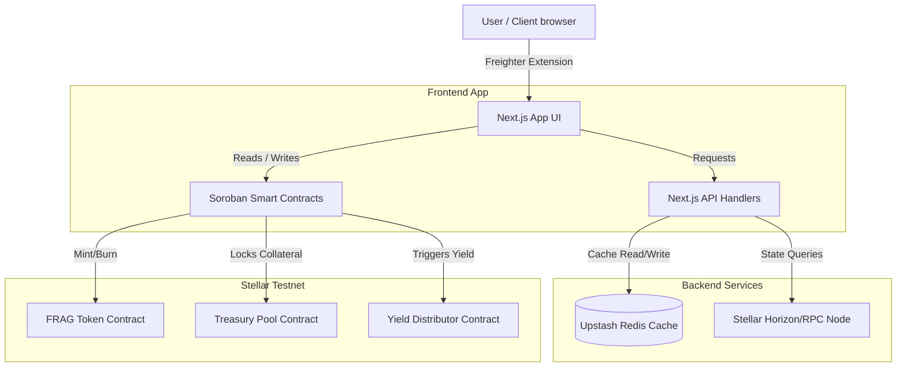

---

## 🧪 Testing Proof & Code Quality

FragmentFi utilizes a strict code quality configuration that is automatically run on every code update.

### Continuous Integration (CI/CD)
The project includes three separate GitHub Action pipelines:
1.  **Lint & Type Check (`lint.yml`):** Runs `eslint` and `npx tsc --noEmit` to ensure TypeScript compilation safety.
2.  **Next.js Build (`nextjs.yml`):** Compiles the Next.js production build securely with optimized output.
3.  **Soroban Contracts (`contracts.yml`):** Sets up Rust, target `wasm32-unknown-unknown`, and runs `cargo test` in all smart contract packages.

### Playwright E2E Tests
E2E automated validation scripts verify major user pathways, such as loading the Proof of Reserves metrics and checking API responses.

To run automated E2E tests locally:
```bash
npx playwright test
```

#### E2E Test Execution Proof
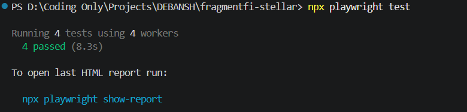

---

## 🚀 Getting Started

### Prerequisites
*   Node.js (v20 or higher)
*   Docker (Optional, for containerized run)
*   Stellar Freighter wallet extension installed in your browser.

### Run Locally (Development)
1.  **Clone the Repository:**
    ```bash
    git clone https://github.com/debansh001/fragmentfi-stellar.git
    cd fragmentfi-stellar
    ```
2.  **Install dependencies:**
    ```bash
    npm install
    ```
3.  **Set up Environment Variables:**
    Create a `.env.local` file in the root directory:
    ```env
    UPSTASH_REDIS_REST_URL="your-upstash-redis-url"
    UPSTASH_REDIS_REST_TOKEN="your-upstash-redis-token"
    JWT_SECRET="your-jwt-signing-secret"
    NEXT_PUBLIC_FRAG_CONTRACT_ID="CAEDL2F6KBY65SFD2OMGZYIKAKCMVL4H2UDKQBPGRWHPEE3GMOXXAIRV"
    NEXT_PUBLIC_TREASURY_CONTRACT_ID="CBKHZFGHG3K7XLKHCIEKGKSNZS2M2QY5ABZJFNBFSNJE4HEN6OMAW6EW"
    NEXT_PUBLIC_YIELD_CONTRACT_ID="CBT7IR4OYDQMAKZTJFJ3FA5JWSEBI5U7QXFM4TYCGDZ35SOOVKIZFPNS"
    ```
4.  **Run Dev Server:**
    ```bash
    npm run dev
    ```
    Open [http://localhost:3000](http://localhost:3000) to view the application!

### Run with Docker (Production Mode)
The application comes preconfigured with a multi-stage Docker build that generates a lightweight standalone Next.js server.

1.  **Build and Run with Docker Compose:**
    ```bash
    docker-compose up --build -d
    ```
2.  **Access the Application:**
    Navigate to [http://localhost:3000](http://localhost:3000). The container exposes standard production logs.

---

## 🔮 Next Phase & Future Vision

*   **Multi-Asset Treasuries:** Expand the collateral backing from single government yields to diversified baskets of high-grade tokenized corporate bonds and commodities.
*   **Yield Auto-Compounding Vaults:** Create customized smart vaults that automatically reinvest interest yields back into the treasury pool to compound user assets.
*   **Decentralized Governance (DAO):** Implement on-chain voting where FRAG token holders can vote on which RWAs are integrated next into the collateral vaults.

---

## ❤️ Acknowledgements & Salutation

Thank you for selecting this idea and giving us the opportunity to work on this exciting project! 

If you like this product and find it valuable, please **star this repository** ⭐. It helps support the development of open-source tokenized finance!

---
*Created by [debansh001](https://github.com/debansh001).*
