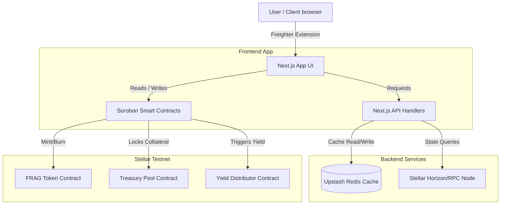

<p align="center">
  
</p>

<h1 align="center">FragmentFi</h1>

<p align="center">
  <strong>Democratizing Institutional Yield Through Tokenized Real-World Assets on Stellar</strong>
</p>

<p align="center">
  
  
  
  
  
  
  
  
</p>

---

## 🔗 Project Links

*   **Vercel Live Deployment:** [https://fragmentfi-stellar.vercel.app/](https://fragmentfi-stellar.vercel.app/)
*   **Demo Video Walkthrough:** [https://youtu.be/OG6kS41sLGg](https://youtu.be/OG6kS41sLGg)

---

## 💡 About The Product

### The Problem We Solve
For decades, high-quality, yield-generating instruments like Treasury Bills, money market funds, and fixed-income products have been locked behind institutional doors. Retail and micro-investors face:
*   **High Financial Barriers:** Massive minimum investment amounts (often $10k+).
*   **Complex Brokerage Onboarding:** Opaque fees, long setup times, and geographical limitations.
*   **Lack of Real-Time Auditing:** Investors are left in the dark about exact asset backing and proof of reserves.

### The Solution: FragmentFi
FragmentFi bridges this gap by tokenizing institutional Real-World Assets (RWA) on the **Stellar blockchain**. 
By fractionalizing asset ownership into liquid, yield-bearing **FRAG tokens**, we enable users to start investing from as little as **$1**, earn automated weekly interest payouts, and verify the collateral reserves dynamically on-chain in real-time.

### Real-World Application
*   **Micro-Savings:** A student or retail investor can buy fractional shares of low-risk, government-backed treasury pools without needing a brokerage account.
*   **24/7 Liquidity:** Unlike traditional fixed-income accounts that lock funds for months, users can withdraw and swap their FRAG tokens back into USDC/XLM at any time.
*   **Auditable Reserves:** Public institutions or funds can show absolute transparency, instantly proving backing assets are greater than or equal to the minted circulating supply.

---

## 💬 User Feedback

*We would love to hear your thoughts! Please leave any feedback, bug reports, or feature suggestions in this space or open a GitHub Issue.*

> **[Space Reserved for User Reviews / Testimonials]**

---

## 📸 Screenshots

*Below is a placeholder for your visual interface screenshots:*

| **Landing & Onboarding** | **Portfolio Dashboard** |
| :---: | :---: |
| *[Insert Landing Page Screenshot]* | *[Insert Dashboard Screenshot]* |

| **Smart Vault Operations** | **Dynamic Reserves Audit** |
| :---: | :---: |
| *[Insert Deposit/Withdrawal Form Screenshot]* | *[Insert Proof of Reserves Gauge Screenshot]* |

---

## 📊 Technical Deep Dive

### Core Technology Stack
| Technology | Role in Architecture | Key Feature / Benefit |
| :--- | :--- | :--- |
| **Next.js 16 (App Router)** | Frontend & Serverless Framework | Fast Server-side rendering (SSR) and dynamic API route handlers. |
| **TailwindCSS** | Design System & Styling | Modern, high-performance, and responsive design components. |
| **TypeScript** | Strict Typings | Prevents compile-time and runtime failures across application states. |
| **Upstash Redis** | High-Speed Cache & Registry | Fast read-write operations for historical charts and Proof of Reserves logs, replacing database-heavy queries. |

### Error Handling & Reliability Strategies
| Error Type | Mitigation Strategy | Realized Benefit |
| :--- | :--- | :--- |
| **Wallet Transaction Rejections** | Custom catch handlers in Freighter sign flows to offer graceful UI warning alerts instead of silent page crashes. | Smooth user experiences during contract interactions. |
| **API Network Failures** | Dynamic mock fallback states in `/api/reserves` and history routing. | The app remains fully functional and readable even if rate limits occur. |
| **Stellar Network Timeout** | `setTimeout(30)` configured on transaction builders before submission. | Ensures transactions do not hang indefinitely in queue. |

### Blockchain & Smart Contract Details
| Smart Contract | Contract ID | Verification Link (Stellar.Expert) |
| :--- | :--- | :--- |
| **FRAG Token** | `CBZ4JGP7252NZLB3XPRKKD2JEVTVNLK763B3CWNKJSLCR2UDABRFEEUT` | [View on Explorer](https://stellar.expert/explorer/testnet/contract/CBZ4JGP7252NZLB3XPRKKD2JEVTVNLK763B3CWNKJSLCR2UDABRFEEUT) |
| **Treasury Pool** | `CADT5HICHEOLODCTCOLVEBC2UX6EAX2RD5WHO5JBBENM4W6H4DZDAYCE` | [View on Explorer](https://stellar.expert/explorer/testnet/contract/CADT5HICHEOLODCTCOLVEBC2UX6EAX2RD5WHO5JBBENM4W6H4DZDAYCE) |
| **Yield Distributor** | `CAQIARO33MYC7Y6BJU5GQAAZK5YPECQ2MLUHBYML3R534QTFHJJFQXGJ` | [View on Explorer](https://stellar.expert/explorer/testnet/contract/CAQIARO33MYC7Y6BJU5GQAAZK5YPECQ2MLUHBYML3R534QTFHJJFQXGJ) |

---

## 📁 File Architecture

```text
fragmentfi-stellar/
├── .github/workflows/          # CI/CD Workflows (Lint, Next.js, Soroban Contracts)
├── app/                        # Next.js App Router Pages
│   ├── api/                    # Serverless API Endpoints (Deposit, Withdraw, Cron, reserves, history)
│   ├── dashboard/              # User Portfolio Dashboard Page
│   ├── deposit/                # Deposit Vault Page
│   ├── reserves/               # Proof of Reserves Page
│   ├── history/                # Transaction History Page
│   ├── layout.tsx              # Main Layout
│   └── page.tsx                # Landing Page
├── components/                 # Shared React Components (Charts, Tables, Forms)
├── contracts/                  # Soroban Smart Contracts (Rust)
│   ├── frag_token/             # FRAG Token Contract (Soroban Rust)
│   ├── treasury_pool/          # Treasury Pool Contract (Soroban Rust)
│   └── yield_distributor/      # Yield Distributor Contract (Soroban Rust)
├── hooks/                      # Custom Hooks (Freighter integration useWallet)
├── lib/                        # Shared utility libraries (stellar, Upstash Redis client)
├── public/                     # Static assets (logo.png, icons)
├── tests/                      # Playwright E2E Tests
├── Dockerfile                  # Multi-stage production Dockerfile
├── docker-compose.yml          # Local Docker Compose setup
├── E2E_TESTING_GUIDE.md        # E2E manual testing guide
└── README.md                   # Main Project Documentation
```

---

## 🌀 Mermaid Diagrams

### User Interaction Workflow

```mermaid
sequenceDiagram
    autonumber
    actor User
    participant Browser as Web Browser (Freighter)
    participant API as Next.js API Routes
    participant Redis as Upstash Redis
    participant Soroban as Stellar Soroban Contract

    User->>Browser: Connect Wallet
    Browser->>User: Request Freighter Approval
    User->>Browser: Approve
    Browser->>API: Authenticate & Retrieve Balance
    API-->>Browser: Session Cookie & User State
    
    rect rgb(20, 20, 30)
        note right of User: Deposit Flow
        User->>Browser: Enter Deposit Amount (e.g. 100 XLM)
        Browser->>API: Generate Tx XDR
        API-->>Browser: Return Unsigned Transaction
        Browser->>User: Request Sign
        User->>Browser: Sign with Private Key
        Browser->>Soroban: Submit Transaction
        Soroban-->>Browser: Success (Mint FRAG)
        Browser->>API: Notify Deposit Success
        API->>Redis: Update Cache & Audit Log
    end
```


### System Architecture


---

## 🧪 Testing Proof & Code Quality

FragmentFi utilizes a strict code quality configuration that is automatically run on every code update.

### Continuous Integration (CI/CD)
The project includes three separate GitHub Action pipelines:
1.  **Lint & Type Check (`lint.yml`):** Runs `eslint` and `npx tsc --noEmit` to ensure TypeScript compilation safety.
2.  **Next.js Build (`nextjs.yml`):** Compiles the Next.js production build securely with optimized output.
3.  **Soroban Contracts (`contracts.yml`):** Sets up Rust, target `wasm32-unknown-unknown`, and runs `cargo test` in all smart contract packages.

### Playwright E2E Tests
E2E automated validation scripts verify major user pathways, such as loading the Proof of Reserves metrics and checking API responses.

To run automated E2E tests locally:
```bash
npx playwright test
```

---

## 🚀 Getting Started

### Prerequisites
*   Node.js (v20 or higher)
*   Docker (Optional, for containerized run)
*   Stellar Freighter wallet extension installed in your browser.

### Run Locally (Development)
1.  **Clone the Repository:**
    ```bash
    git clone https://github.com/debansh001/fragmentfi-stellar.git
    cd fragmentfi-stellar
    ```
2.  **Install dependencies:**
    ```bash
    npm install
    ```
3.  **Set up Environment Variables:**
    Create a `.env.local` file in the root directory:
    ```env
    UPSTASH_REDIS_REST_URL="your-upstash-redis-url"
    UPSTASH_REDIS_REST_TOKEN="your-upstash-redis-token"
    JWT_SECRET="your-jwt-signing-secret"
    NEXT_PUBLIC_FRAG_CONTRACT_ID="CBZ4JGP7252NZLB3XPRKKD2JEVTVNLK763B3CWNKJSLCR2UDABRFEEUT"
    NEXT_PUBLIC_TREASURY_CONTRACT_ID="CADT5HICHEOLODCTCOLVEBC2UX6EAX2RD5WHO5JBBENM4W6H4DZDAYCE"
    NEXT_PUBLIC_YIELD_CONTRACT_ID="CAQIARO33MYC7Y6BJU5GQAAZK5YPECQ2MLUHBYML3R534QTFHJJFQXGJ"
    ```
4.  **Run Dev Server:**
    ```bash
    npm run dev
    ```
    Open [http://localhost:3000](http://localhost:3000) to view the application!

### Run with Docker (Production Mode)
The application comes preconfigured with a multi-stage Docker build that generates a lightweight standalone Next.js server.

1.  **Build and Run with Docker Compose:**
    ```bash
    docker-compose up --build -d
    ```
2.  **Access the Application:**
    Navigate to [http://localhost:3000](http://localhost:3000). The container exposes standard production logs.

---

## 🔮 Next Phase & Future Vision

*   **Multi-Asset Treasuries:** Expand the collateral backing from single government yields to diversified baskets of high-grade tokenized corporate bonds and commodities.
*   **Yield Auto-Compounding Vaults:** Create customized smart vaults that automatically reinvest interest yields back into the treasury pool to compound user assets.
*   **Decentralized Governance (DAO):** Implement on-chain voting where FRAG token holders can vote on which RWAs are integrated next into the collateral vaults.

---

## ❤️ Acknowledgements & Salutation

Thank you for selecting this idea and giving us the opportunity to work on this exciting project! 

If you like this product and find it valuable, please **star this repository** ⭐. It helps support the development of open-source tokenized finance!

---
*Created by [debansh001](https://github.com/debansh001).*
