<p align="center">
  
</p>

<h1 align="center">FragmentFi</h1>


<p align="center">
  <strong>Democratizing Institutional Yield Through Tokenized Real-World Assets on Stellar</strong>
</p>

<p align="center">
  
  
  
  
  
  
  
  
</p>

<p align="center">
  <a href="https://github.com/debansh001/fragmentfi-stellar/actions/workflows/contracts.yml"></a>
  <a href="https://github.com/debansh001/fragmentfi-stellar/actions/workflows/nextjs.yml"></a>
  <a href="https://github.com/debansh001/fragmentfi-stellar/actions/workflows/lint.yml"></a>
</p>

---

## 🔗 Project Links

*   **Vercel Live Deployment :** [https://fragmentfi-stellar.vercel.app/](https://fragmentfi-stellar.vercel.app/)
*   **Demo Video Walkthrough :** [https://youtu.be/CPQYAlBt0d8](https://youtu.be/CPQYAlBt0d8)
*   **Product Pitch :** [FragmentFi Pitch](https://drive.google.com/file/d/17PqbAhDwsV5Ks_2KE1hgwT7zs6QtPOkz/view?usp=sharing) *(Google Slides Link)*

### 📚 Documentation Pages

| Page | URL |
|---|---|
| **Docs Home** | [fragmentfi-stellar.vercel.app/docs](https://fragmentfi-stellar.vercel.app/docs) |
| **Features** | [fragmentfi-stellar.vercel.app/docs/features](https://fragmentfi-stellar.vercel.app/docs/features) |
| **Usage Guide** | [fragmentfi-stellar.vercel.app/docs/usage](https://fragmentfi-stellar.vercel.app/docs/usage) |
| **Local Setup** | [fragmentfi-stellar.vercel.app/docs/setup](https://fragmentfi-stellar.vercel.app/docs/setup) |
| **Implementation** | [fragmentfi-stellar.vercel.app/docs/implementation](https://fragmentfi-stellar.vercel.app/docs/implementation) |
| **Smart Contracts** | [fragmentfi-stellar.vercel.app/docs/contracts](https://fragmentfi-stellar.vercel.app/docs/contracts) |
| **Architecture** | [fragmentfi-stellar.vercel.app/docs/architecture](https://fragmentfi-stellar.vercel.app/docs/architecture) |
| **How It Works** | [fragmentfi-stellar.vercel.app/how-it-works](https://fragmentfi-stellar.vercel.app/how-it-works) |
| **Contact** | [fragmentfi-stellar.vercel.app/contact](https://fragmentfi-stellar.vercel.app/contact) |

---

## 💡 About The Product

### The Problem We Solve
For decades, high-quality, yield-generating instruments like Treasury Bills, money market funds, and fixed-income products have been locked behind institutional doors. Retail and micro-investors face:
*   **High Financial Barriers:** Massive minimum investment amounts (often $10k+).
*   **Complex Brokerage Onboarding:** Opaque fees, long setup times, and geographical limitations.
*   **Lack of Real-Time Auditing:** Investors are left in the dark about exact asset backing and proof of reserves.

### The Solution: FragmentFi
FragmentFi bridges this gap by tokenizing institutional Real-World Assets (RWA) on the **Stellar blockchain**. 
By fractionalizing asset ownership into liquid, yield-bearing **FRAG tokens**, we enable users to start investing from as little as **$1**, earn automated weekly interest payouts, and verify the collateral reserves dynamically on-chain in real-time.

### Real-World Application
*   **Micro-Savings:** A student or retail investor can buy fractional shares of low-risk, government-backed treasury pools without needing a brokerage account.
*   **24/7 Liquidity:** Unlike traditional fixed-income accounts that lock funds for months, users can withdraw and swap their FRAG tokens back into USDC/XLM at any time.
*   **Auditable Reserves:** Public institutions or funds can show absolute transparency, instantly proving backing assets are greater than or equal to the minted circulating supply.

---

## 💬 User Feedback

We value your feedback! Feel free to share your thoughts, rate the experience, and report bugs:
*   📝 **Submit Feedback (Google Form):** [Google Form Link](https://forms.gle/NiVTmRWZgQGyu4nB9)
*   📊 **View Live Responses (Google Sheets):** [Google Sheets Link](https://docs.google.com/spreadsheets/d/12ABdXFaiQGYXMwTV74UJRCZkWvTOdVarAW-r5xTDxGk/edit?usp=sharing)

Below is a detailed log of the latest user reviews, including the commit links where the feedback issues are addressed:

| Full Name | Wallet Address | Feature it's lacking | Specific feedback or suggestion | Github commit link |
| --- | --- | --- | --- | --- |
| **Saunak Basak** | `GAKJ6VMQSJQ7S55YNQUSBVETOTANGE3NTG4CHTW3IPOEAT7SXG6UZEWB` | NA | I liked it's UI its awesome. | - |
| **Rupam Ghosh** | `GBV4FZVZKT26JNLAIMGSNUDDREZLP4ESPOMDA4X6LGBTLUP5XAP73TXI` | Work more on UI | Overall experience is good | - |
| **Sadiya Mulani** | `GADSVJJYMZTCIDB4NVGXKKPNMNGAZRFXIV5534U7QK6R4IYNSWMZDA65` | Adding better loading states, clearer user guidance, and improved mobile responsiveness would make the app even better. | Well-designed app with a solid concept. Improving user guidance and responsiveness would elevate the overall experience. | [View Commit (Verify)](https://github.com/debansh001/fragmentfi-stellar/commit/cffadcc) |
| **Najmi** | `GA6JIOI5KKODI3S3BKU52QARE6FIU5GSPLEMJOAFI7QLAZDWQMIJ7ORO` | no | nothing, thats enough | - |
| **Anubhab Rakshit** | `GDRB3FLKYARUXJF6DHX6MQPY7S5ZCXGTOSDIGSLLCZK3ITZ4CCHRS6DL` | A bit of ui fixes , rest every thing is fine | It was good and something different | - |
| **Amitabh Dey** | `GAZOJETEANC2WBUEDUJGZSYEKDRE2XP3FF7S3MCLA2YJUGJ5M3QHEBSN` | its superb | Damn i literally jus love the app i can use albedo and freighter both plus a reward system really good | - |
| **Lohit Mishra** | `GDYWYDOBPPM2XFQS2N7OA2XYO66C24OSBDGASSYAU7V3V4UHFIQYWCRL` | at yield payout its throwing wwhole bunch error of code | error calls are coming in frontend not a good sign it should through a caution msg like u cant do that on this time like that not whole bunch of code wire it up properly | [View Commit (Verify)](https://github.com/debansh001/fragmentfi-stellar/commit/63c3c85) |
| **Aditya Kumar** | `GALK4MID2BKRGDIFYAGRBJ3P2ZDSQJQASWMFAEMP25DPO2O5ISMXVTTB` | NA. | I just tried it and it felt smooth from my side. | - |
| **Souvik Mandal** | `GDFKLTB5WKKDDJ2NRU2V5OG476HYEGWT4UFV7BID7BNGWZGRZYL3LL6Z` | I will recommend a card showing the balance in the wallet on clicking on the wallet address. | Felt awesome. I like the onboarding experience and walkthrough guide. | [View Commit (Verify)](https://github.com/debansh001/fragmentfi-stellar/commit/cffadcc) |
| **Pritam Pal** | `GA4SXARZZ4RPF6N7VOAH3B5OKMFAP3FGY6M6TO3DZJL4TMU2KOVBHCIY` | NA | Just love the idea and its unique. | - |
| **Niladri Mahato** | `GB23YPDN4ZLLFHTLKMTRBGEGI37GPGYXHMCORML35PD7SQA5XKKE2PWA` | Getting some error while deposit both USDC and XLM | UI and all the stuffs is good | [View Commit (Verify)](https://github.com/debansh001/fragmentfi-stellar/commit/fcf187c) |
| **Sudhir Majhi** | `GDYF2MPWHTXE63DVLGG3H4JKTCBQ24OZAMGMLBMYY3IEIJLOCVD5CZDU` | Checked the app and I think need to fix the ladning page more things are need to be added there. | Overall app idea is good | [View Commit (Verify)](https://github.com/debansh001/fragmentfi-stellar/commit/4039e5c) |
| **Arpan Dutta** | `GDX4565AJ4DBGP3HGDIV7F6QJ3IPOVDLG3BOXTHS5ITWKJMEWND3Y7HK` | No everything is working fine | all good the UI is very nice | - |
| **Aman Ghoel** | `GDCP2LXKUNBHFV4FPG4SDRIIQ5WVJ2OWH7WJWBHOK5TCNXKSDI74O32G` | While claiming yield I encountered an eror please check it once. | Averll app is smooth and user friendly no issues with that. | [View Commit (Verify)](https://github.com/debansh001/fragmentfi-stellar/commit/e3225e7) |
| **Shanto Pramanik** | `GCSHXA2QD4RS35O2D7OCIRUT6ONNHDWN42YAFTQUT6NWGKGCUGBASQNQ` | no | Product Idea and UI is good for this app | - |
| **Rajat Dutta** | `GAJUWETQPUT4RH6BHWDQOMC6EPTMMW4Q3IW46KSMCZLN7Y25NCLQBOV3` | Features are working | Very smooth onboarding I liked this not much hassle and trasnectio nUI and components are great again. | - |
| **Ritesh Maity** | `GBA6F4HQIJ6UY7WXUH2KRMHYIVX57MRFWZP7QS7EB267MYCKJARMH6UP` | na | investing a safely with this product with a petty amount is abosolutely nice | - |
| **Ayushi Nandi** | `GAREG55YYVOTXCA6MK3RKMFNJ2VPNIET3VIEFFJTCQAVFUHFI6CDVGPN` | Top tab the the balance is not displaying properly and also enhance that part a bit like the wallet can be copied. | Everything is working fine. | [View Commit (Verify)](https://github.com/debansh001/fragmentfi-stellar/commit/7c58220) |
| **Soumi Das** | `GDAUYKURO274AJDEBF5JZDUP5RDBQM6PGUSRVZ7LVSPU25HMBRUQRPY6` | A profile tab is expected I think it should be there | All the featuers are working but couldn't understand the reserve thing | [View Commit (Verify)](https://github.com/debansh001/fragmentfi-stellar/commit/3d33b8e) |
| **Olivia Ghosal** | `GC5TRX7OLZP57WKSLIACKAXO7YGHR4NI4BSS3SR3NQDMJL3JDSF7WZJ4` | I think if you could provide a dark light theme button it would be better. | The begginers guide for this website is very nice I like that. | [View Commit (Verify)](https://github.com/debansh001/fragmentfi-stellar/commit/38b1aec) |
| **Utsab Basak** | `GBYIJRF5CW4QG3XBETDBCNS3K7R65CEDNB4J3QBWKEIPVWMU6MKNIPW6` | NA | Product is nice no issues | - |
| **Krishna Mondal** | `GDDLLEWZE3IZKVHOOPZ2ZVQMJ2HOYFGCHEKMJA3PXY2J7TPK5GDDDQYL` | no | Unique way of investing cool product | - |
| **Asutosh Sharma** | `GDBXA3NAGRLTYP7NI6EIS4QT273UUWHZYN4KCO7JT2E5VYYBSG2CQFYJ` | I didn't encounter any error | Plan is nice execution is also nice so the idea | - |
| **Asmaan Verma** | `GDNWLN3JLOCPWWL3WNXKN5PNPHDCJVJR2337VCK3NFK3HCXIDLU2QERC` | I got no issues | Best way to invest and have safe returns | - |
| **Rashmi Sharma** | `GB3G5ZU7BL3PXWZIOJIETBF6FROFEMZVJJVRUUBTZVNRMLJAQPNPLK5Q` | No scope found but a white backgorund is recommended | UI is very nice | [View Commit (Verify)](https://github.com/debansh001/fragmentfi-stellar/commit/38b1aec) |
| **Jogesh Mandal** | `GD37TTSTX22Y24CAKWO45IKKHEMDYVEK7MEE7QC6C4O6VAIDXCEK4VL4` | no such thing need but a dark and white mode toggle would be good | easy onboarding and payments | [View Commit (Verify)](https://github.com/debansh001/fragmentfi-stellar/commit/38b1aec) |
| **Abhinash Parikh** | `GC22Z2IN3ROLZFW3JEU64C4IZZ74Z5RZWOG4OO64FJPKNMS77GZGVBMA` | Small money dafe place and also good returns | No | - |
| **Arif Ali** | `GBQWJUMYCSE63MT2XBAYK4BMMAJJFNTOR46QGPST4BLSPWBNGLU6FFHD` | I think the withdraw and deposit tab is having very less information and have lots of space pellase use that empty space | Everything is working fine. Custom Frag token and trade with it is nice. | [View Commit (Verify)](https://github.com/debansh001/fragmentfi-stellar/commit/eb288d8) |
| **Riddhiman Sen** | `GC5J6BN4BXXNE6DR6OHJSRH4WH4EZEFIO4AM2KRNFZEA5DCI3QFKODKA` | Overall app experience is nice good app | I didn't encounter any bugs | - |
| **Abhijit Tiwari** | `GC23LEPSSBJL4VJK6LK5RIRRX2ZKJ3OTVXHJT6HSWPMZ4JJDXE3ZRUPE` | Good Idea | No bug found | - |
| **Pramit Nandi** | `GDFEYX5Q7UT4ZUREVHPULKYD6C3EKWQDTJY76OXYWTRTUE7PKUSKWJZG` | I think profile tab could be done better seeking more inforamtion from user like email and more info for maketting purpose. | App is nice onboarding with wallet is hreat initiactive | [View Commit (Verify)](https://github.com/debansh001/fragmentfi-stellar/commit/b8363e8) |
| **Ayan Goswami** | `GBJA4Z6IXQLVZWMM3U7C7PFRFHWO7CZ3S62SPC6TX2NLV4XS2MQHBC4F` | I like the Idea and overall good imeplementation | No | - |
| **Gourab Basak** | `GCVODPBH7PNE6AENNEYO6PFDH3VSF5JKYH6ULN3ZICROIWYAGJWLXSJY` | UI is very nice | NA | - |
| **Rachin Patil** | `GDQJ7VPDOB247LD6D4QD6UQIYBKNVFU7UKNJGE55K77S23XMG77NEY33` | IF possible amke it more transparent in the RESERVE page about what all investvent are being done like the details users can be given like I want to maintain transparency. | Very nice app. NOt muxh mewss very straight forward | [View Commit (Verify)](https://github.com/debansh001/fragmentfi-stellar/commit/429419a) |
| **Sanket Dey** | `GCVRAIG5F2ECKA2I6AGKYXFLFTUTWBROCXLQET7WX3SZEKBFX6M2SJAH` | NA | App is good but I tested it and found vulgaribility in authentication paelase check that once. | [View Commit (Verify)](https://github.com/debansh001/fragmentfi-stellar/commit/0e3fce1) |
| **Rakesh Dutta** | `GCKF7AIJJ5TCJ2MW5TMDSALFHSGKIJTZ5ML3PJ3P6N5726E2GQXVXBNI` | FragemntFI idea is good want to see more growth of it. | NA | - |
| **Roni Mondal** | `GAUVTXZPGQSA3AILP4WLQTDY2WTG5SE7PY4VN3CFNT6HMT2Z7VMYAASS` | Product Idea is very good | I think more work to be needed its very simple looking deposit and withdrawl just. | [View Commit (Verify)](https://github.com/debansh001/fragmentfi-stellar/commit/3fb6b00) |
| **Debanshu Nath** | `GA7A4OHK55D3YRLLQJLIM7Y6R3TXGT45DPSHVSWRXLSUIDJSBTBTPWAW` | Smooth Trasnection zero lag | No issues | - |
| **Jayeta Bose** | `GAVNKQJQH67HIDKS3VQVWQJKWO5CYO3INGXS7Y3NJBBM42L4QFU7NZ4X` | Product is good | No everything ok from my side | - |
| **Saphoia Ansari** | `GB6TDEABOPVRD5P4BESJ3SD4J2XMJ3NQF6RIND77ZUSAJLRJSULLSFQX` | Overall app is good but its very small I think more features are needed. | No error everything is fine | [View Commit (Verify)](https://github.com/debansh001/fragmentfi-stellar/commit/3fb6b00) |
| **Samuel Pandey** | `GAAQ5DEN4X6RGDZRW7MJDJOZHCZOK7OJJLH7GKDZDQP6FQZJ7JJTF674` | UI is very light and good | This product is good currently but sufficent | - |
| **Mainak Dutta** | `GCZN6JR6IVSFUSMZR2QQZACDBTM2GCRMEEZGGU3F2GNNWVTPOCDVE7TU` | Idea is good | Mistakenly I did deposit USDC I thought it will fail but it worked unfortunately but the txn hash is not opening when clicking on verify I think its mock data. | [View Commit (Verify)](https://github.com/debansh001/fragmentfi-stellar/commit/3fb6b00) |
| **Vinayak Losalka** | `GCYTO76ZKKWHLHX46PUUGFOW6O5G2URMDX6WSOKB5UVJIWJIOHODCOSK` | Overall UI is very food and onboarding is also very nice. | No | - |
| **Jaijeet Manna** | `GBIAUXOC7DQVN4DK2PU3KUDDRP4WP3IKXYPETELZLQGKJBTNY4QYKQDJ` | I like how ease the investing is through this app | Nothing like that got | - |
| **Fardin Rahman** | `GALN6TPIOE5NAFYA3MEE4L2KPXM7CKHJRSEWOWMBGQ6KYCU7U5UMCRKS` | Overall product is good | Nothing like that got its good | - |
| **Yugli** | `GAMQZW6Q5OYO7KHIMTS5DQQ7CFN5PIAL4CJWNLJ5M4P4X72BQSDEQDPG` | Trasnection spped is fast I liked it | I didn't find error | - |
| **Adrija Majhi** | `GDWXLJIZDOY5THKEGWKZXD245SU4BVJSVJ63LI4PAUY4KMR4JPRCZFBP` | Very good idea | Uer can claim yield without investment is that a valid move if so add a banner about what is happing its confusing for me. | [View Commit (Verify)](https://github.com/debansh001/fragmentfi-stellar/commit/65cbd27) |
| **Subhankar Maity** | `GAJ7DRJCSIJDLH4JJYXQ4MWG5GHSK56AYCQUGKKW4OFYXGDAH3G2FXRN` | Saw something different. Good Work | Nothing to say just keep it up! | - |
| **Mandira Paul** | `GBY5SUTENI56R6I2O2C6Y3IT6YD2STF76DDUXPILZU4NIEEP7RQCAWSI` | Overall the transection are smooth no issues with that | NA | - |
| **Sammanay Das** | `GAQKUIGCICSMZ6UCUHAH7PVI7VIFKK464M5RIARN77VXO4KAV2RTNYSU` | Nice app and UI transition is smooth | No its fine | - |
| **Gouri Debnath** | `GDSHPINMELPVJEFCBVO5ZQYYB2CC7YQPGM2L3UPOIJLROO5MAMIIYO7X` | No issues and its easy for me to handle not being from this web3 background. | No such scope found | - |

---

## 📸 Screenshots

| **Landing & Onboarding** | **Portfolio Dashboard** |
| :---: | :---: |
| 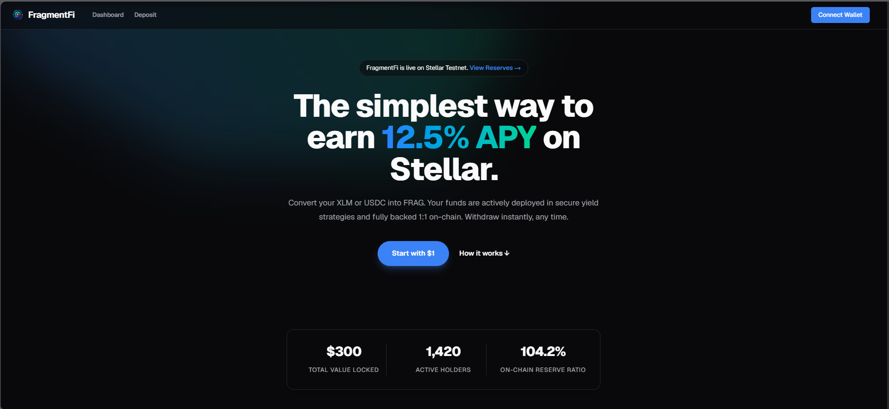 | 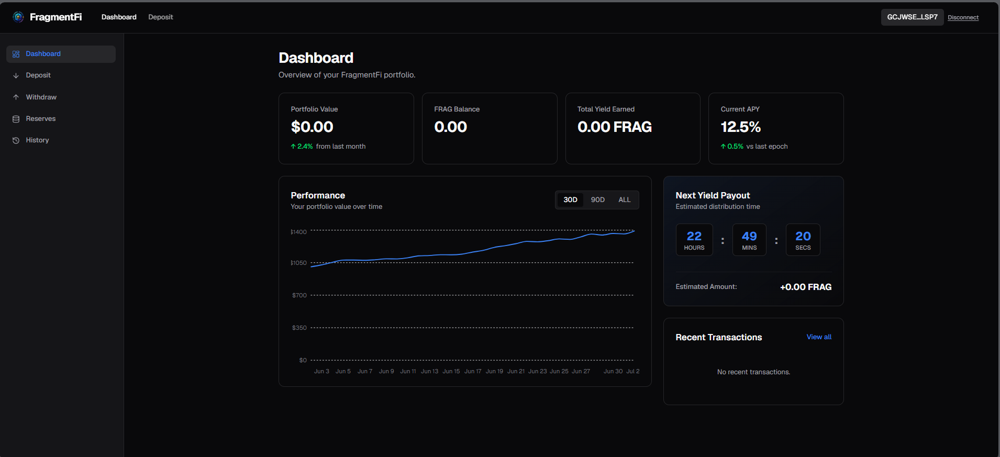 |

| **Deposit Vault** | **Withdrawal Vault** |
| :---: | :---: |
| 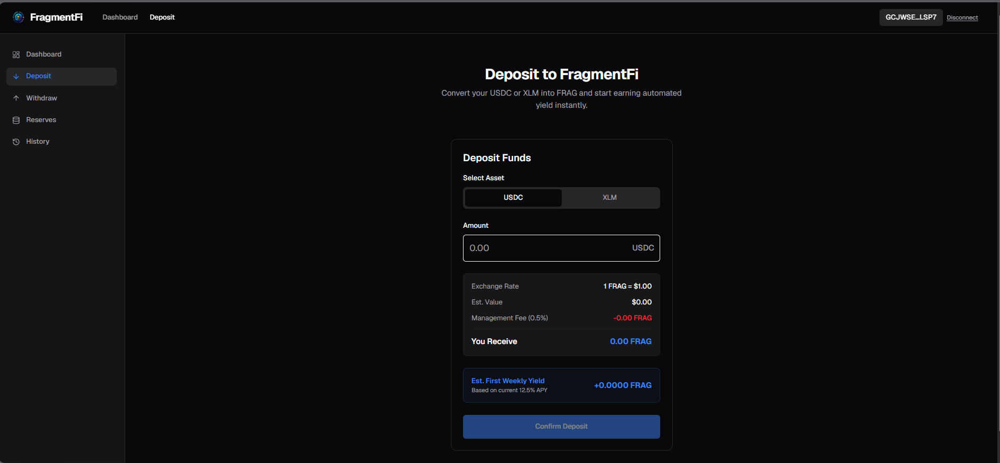 | 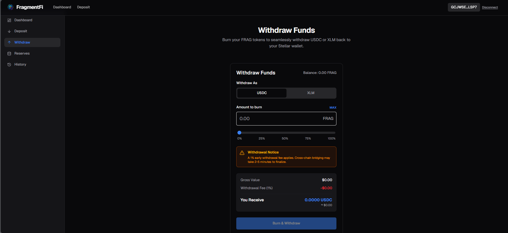 |

| **Proof of Reserves** | **Transaction History** |
| :---: | :---: |
| 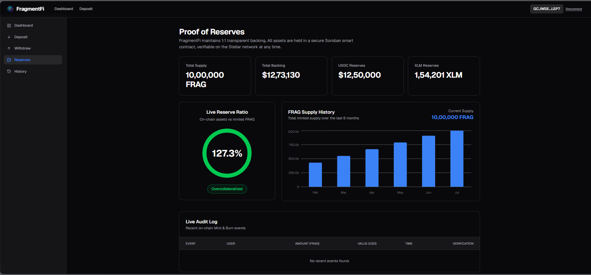 | 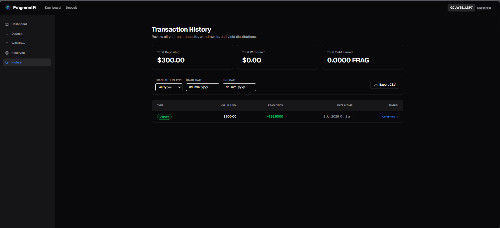 |

### 📱 Mobile Views

| **Landing Page** | **Portfolio Dashboard** |
| :---: | :---: |
| 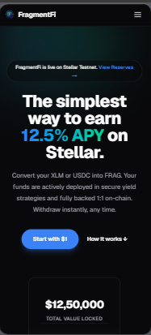 | 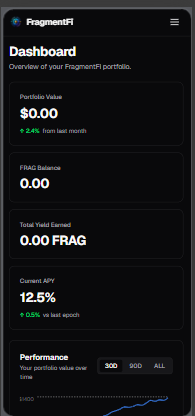 |

---

## 📊 Technical Deep Dive

### Core Technology Stack
| Technology | Role in Architecture | Key Feature / Benefit |
| :--- | :--- | :--- |
| **Next.js 16 (App Router)** | Frontend & Serverless Framework | Fast Server-side rendering (SSR) and dynamic API route handlers. |
| **TailwindCSS** | Design System & Styling | Modern, high-performance, and responsive design components. |
| **TypeScript** | Strict Typings | Prevents compile-time and runtime failures across application states. |
| **Upstash Redis** | High-Speed Cache & Registry | Fast read-write operations for historical charts and Proof of Reserves logs, replacing database-heavy queries. |

### Error Handling & Reliability Strategies
| Error Type | Mitigation Strategy | Realized Benefit |
| :--- | :--- | :--- |
| **Wallet Transaction Rejections** | Custom catch handlers in Freighter sign flows to offer graceful UI warning alerts instead of silent page crashes. | Smooth user experiences during contract interactions. |
| **API Network Failures** | Dynamic mock fallback states in `/api/reserves` and history routing. | The app remains fully functional and readable even if rate limits occur. |
| **Stellar Network Timeout** | `setTimeout(30)` configured on transaction builders before submission. | Ensures transactions do not hang indefinitely in queue. |

### 💎 Level 5 Stellar Integration (Testnet Deployments)
FragmentFi is built to showcase advanced integration with the Stellar network. We utilize SEP standards, SDEX atomic swaps, and Soroban cross-contract architecture.

| Contract Component | Testnet ID | Explorer Link |
| :--- | :--- | :--- |
| **FRAG Token (SEP-41)** | `CA4BQ6NHOQ2TNI2PEHPK6KA7JQOF2SCPXO334HUGRSLALDL6YSRQOZKN` | [View on Explorer](https://stellar.expert/explorer/testnet/contract/CA4BQ6NHOQ2TNI2PEHPK6KA7JQOF2SCPXO334HUGRSLALDL6YSRQOZKN) |
| **Treasury Pool** | `CB7WUBMBWKWLIM2UR5S4FW7KYH3ZKSXXUWIJN3UK2PUZU6U56RIFOBLT` | [View on Explorer](https://stellar.expert/explorer/testnet/contract/CB7WUBMBWKWLIM2UR5S4FW7KYH3ZKSXXUWIJN3UK2PUZU6U56RIFOBLT) |
| **Yield Distributor** | `CCYD7AI3X5VLDQJCWC7EXCRNDQDYMEGJ6RPXLEDZDD4DNK576HGYMUAB` | [View on Explorer](https://stellar.expert/explorer/testnet/contract/CCYD7AI3X5VLDQJCWC7EXCRNDQDYMEGJ6RPXLEDZDD4DNK576HGYMUAB) |

### On-Chain Transactions Proof
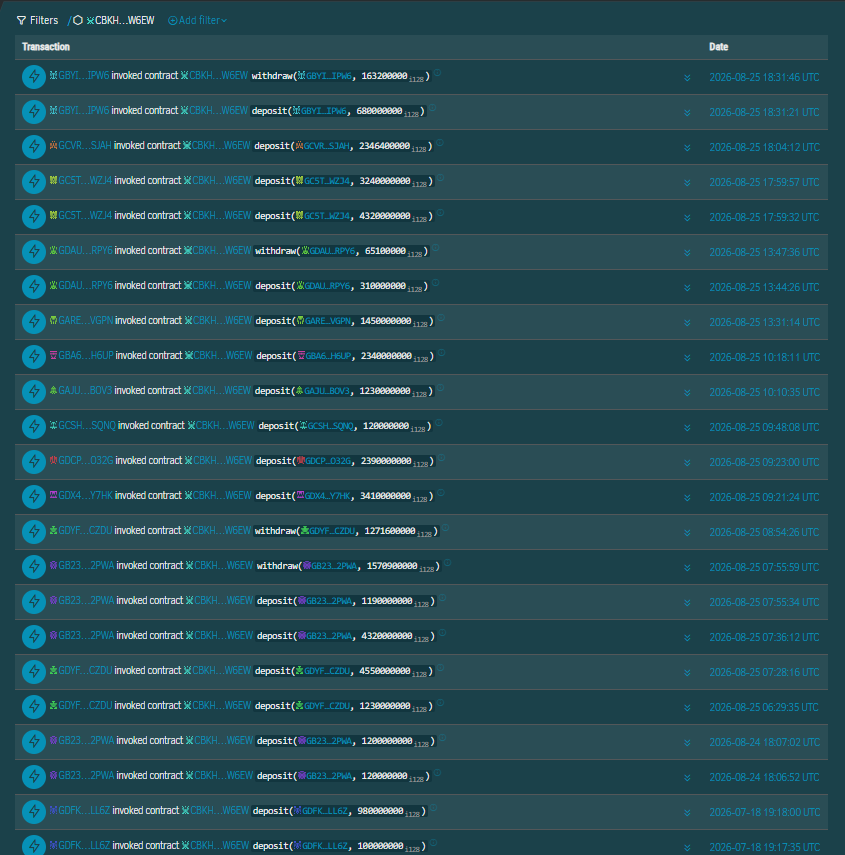

---

## 📁 File Architecture

## 📚 Official Documentation

The complete documentation for FragmentFi, including Setup, Usage, Architecture, Smart Contracts, and our User Feedback Journey, has been moved to its own dedicated standalone website.

👉 **[View Full Documentation Here](https://fragmentfi-docs-site.vercel.app)**

---

## 🏗 Directory Structure

```text
fragmentfi-stellar/
├── .github/workflows/          # CI/CD Workflows
├── app/                        # Main Web3 App (Next.js)
├── components/                 # Shared React Components
├── contracts/                  # Soroban Smart Contracts (Rust)
├── docs-site/                  # Dedicated Documentation Website (Standalone Next.js App)
├── hooks/                      # Custom Hooks (Freighter integration)
├── lib/                        # Shared libraries
├── public/                     # Static assets
└── tests/                      # Playwright E2E Tests
```

---

## 🌀 Mermaid Diagrams

### User Interaction Workflow
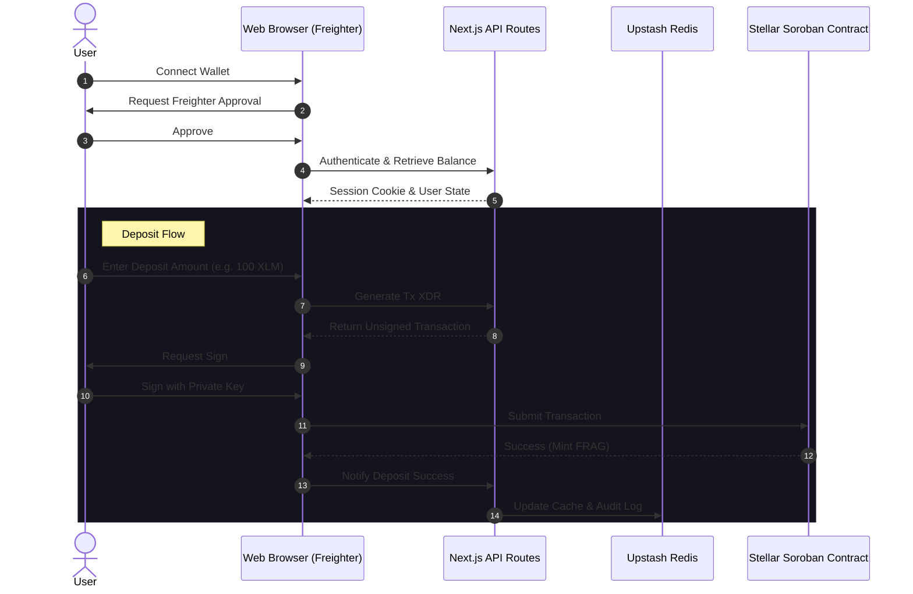
```mermaid
sequenceDiagram
    autonumber
    actor User
    participant Browser as Web Browser (Freighter)
    participant API as Next.js API Routes
    participant Redis as Upstash Redis
    participant Soroban as Stellar Soroban Contract

    User->>Browser: Connect Wallet
    Browser->>User: Request Freighter Approval
    User->>Browser: Approve
    Browser->>API: Authenticate & Retrieve Balance
    API-->>Browser: Session Cookie & User State
    
    rect rgb(20, 20, 30)
        note right of User: Deposit Flow
        User->>Browser: Enter Deposit Amount (e.g. 100 XLM)
        Browser->>API: Generate Tx XDR
        API-->>Browser: Return Unsigned Transaction
        Browser->>User: Request Sign
        User->>Browser: Sign with Private Key
        Browser->>Soroban: Submit Transaction
        Soroban-->>Browser: Success (Mint FRAG)
        Browser->>API: Notify Deposit Success
        API->>Redis: Update Cache & Audit Log
    end
```

### System Architecture
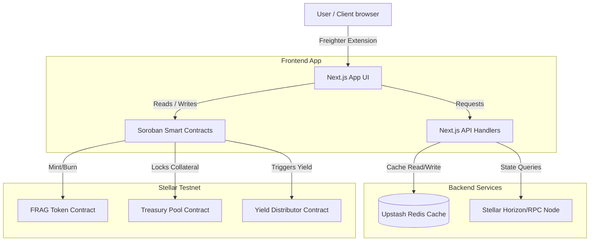
```mermaid
graph TD
    User[User / Client browser] -->|Freighter Extension| FE[Next.js App UI]
    
    subgraph Frontend App
        FE -->|Requests| API[Next.js API Handlers]
        FE -->|Reads / Writes| SC[Soroban Smart Contracts]
    end

    subgraph Backend Services
        API -->|Cache Read/Write| Redis[(Upstash Redis Cache)]
        API -->|State Queries| Node[Stellar Horizon/RPC Node]
    end

    subgraph Stellar Testnet
        SC -->|Mint/Burn| FRAG[FRAG Token Contract]
        SC -->|Locks Collateral| Pool[Treasury Pool Contract]
        SC -->|Triggers Yield| Yield[Yield Distributor Contract]
    end
```

---

## 🧪 Testing Proof & Code Quality

FragmentFi utilizes a strict code quality configuration that is automatically run on every code update.

### Continuous Integration (CI/CD)
The project includes three separate GitHub Action pipelines:
1.  **Lint & Type Check (`lint.yml`):** Runs `eslint` and `npx tsc --noEmit` to ensure TypeScript compilation safety.
2.  **Next.js Build (`nextjs.yml`):** Compiles the Next.js production build securely with optimized output.
3.  **Soroban Contracts (`contracts.yml`):** Sets up Rust, target `wasm32-unknown-unknown`, and runs `cargo test` in all smart contract packages.

### Playwright E2E Tests
E2E automated validation scripts verify major user pathways, such as loading the Proof of Reserves metrics and checking API responses.

To run automated E2E tests locally:
```bash
npx playwright test
```

#### E2E Test Execution Proof
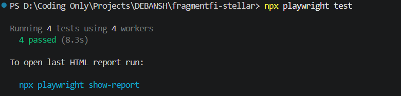

### Production Web Analytics
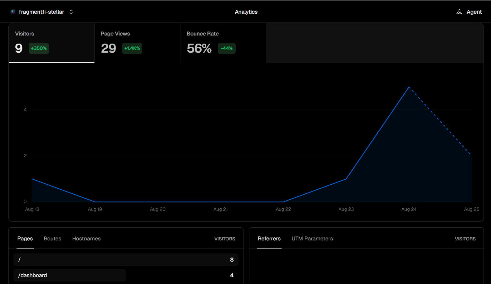

---

## 🚀 Getting Started

### Prerequisites
*   Node.js (v20 or higher)
*   Docker (Optional, for containerized run)
*   Stellar Freighter wallet extension installed in your browser.

### Run Locally (Development)
1.  **Clone the Repository:**
    ```bash
    git clone https://github.com/debansh001/fragmentfi-stellar.git
    cd fragmentfi-stellar
    ```
2.  **Install dependencies:**
    ```bash
    npm install
    ```
3.  **Set up Environment Variables:**
    Create a `.env.local` file in the root directory:
    ```env
    UPSTASH_REDIS_REST_URL="your-upstash-redis-url"
    UPSTASH_REDIS_REST_TOKEN="your-upstash-redis-token"
    JWT_SECRET="your-jwt-signing-secret"
    NEXT_PUBLIC_FRAG_CONTRACT_ID="CA4BQ6NHOQ2TNI2PEHPK6KA7JQOF2SCPXO334HUGRSLALDL6YSRQOZKN"
    NEXT_PUBLIC_TREASURY_CONTRACT_ID="CB7WUBMBWKWLIM2UR5S4FW7KYH3ZKSXXUWIJN3UK2PUZU6U56RIFOBLT"
    NEXT_PUBLIC_YIELD_CONTRACT_ID="CCYD7AI3X5VLDQJCWC7EXCRNDQDYMEGJ6RPXLEDZDD4DNK576HGYMUAB"
    ```
4.  **Run Dev Server:**
    ```bash
    npm run dev
    ```
    Open [http://localhost:3000](http://localhost:3000) to view the application!

### Run with Docker (Production Mode)
The application comes preconfigured with a multi-stage Docker build that generates a lightweight standalone Next.js server.

1.  **Build and Run with Docker Compose:**
    ```bash
    docker-compose up --build -d
    ```
2.  **Access the Application:**
    Navigate to [http://localhost:3000](http://localhost:3000). The container exposes standard production logs.

---

## 🔮 Next Phase & Future Vision

*   **Multi-Asset Treasuries:** Expand the collateral backing from single government yields to diversified baskets of high-grade tokenized corporate bonds and commodities.
*   **Yield Auto-Compounding Vaults:** Create customized smart vaults that automatically reinvest interest yields back into the treasury pool to compound user assets.
*   **Decentralized Governance (DAO):** Implement on-chain voting where FRAG token holders can vote on which RWAs are integrated next into the collateral vaults.

---

## ❤️ Acknowledgements & Salutation

Thank you for selecting this idea and giving us the opportunity to work on this exciting project! 

If you like this product and find it valuable, please **star this repository** ⭐. It helps support the development of open-source tokenized finance!

---
*Created by [debansh001](https://github.com/debansh001).*
